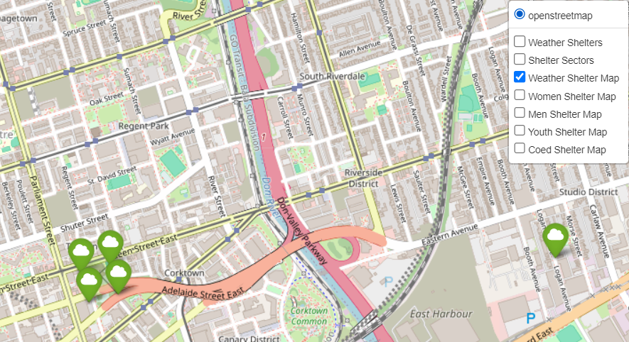

## Overview
# Homeless Shelter Visualization Project
This project is designed to analyze and visualize the homeless shelter occupancies in Toronto for the year of 2020.
The dataset used in this project has been obtained from the City of Toronto's Open Data Portal. Please refer to the following link to access the data: https://open.toronto.ca/dataset/daily-shelter-occupancy/.
The map presents different shelters which are primarily dispersed across the City of Toronto, with some shelters located in other cities.

Different menu options, such as the ability to filter shelters by their sector demographic (men, women, etc.) as well as the ability to visualize a particular program's occupancy with respect to other shelters are also included.
The different libraries used are listed as follows:
- folium 
- pandas 
- numpy
- pgeocode

Folium is a library within python that allows for the visualization of interactive maps. It is built on the Leaflet.js library which is widely known for web visualization capabilities. 
Every calculation performed within this project was done with the goal of eventually using those calculations for visualization of data. 
As such, folium was very important in the functionality of this program.
In order to access the different menus in the dropdown, the user must hover on the top right of the visualization. 

Here, we can see two layers on an icon. By hovering on that icon, we can toggle different menus on and off. 
Simply access the menu of your choice. Please note that by default, all menus are turned on.

On the bottom right of the interface, the user can access a minimap. This minimap allows the user to visualize the map in a small box as well as access different parts of the map easily by dragging on location in the box.

Since many shelters can have multiple programs, many of the programs are hidden in green bubbles. To 
access all programs, click on the green bubble. 

Before: 

After:

In addition, the user can also access an information popup for each shelter that displays
key information regarding its, name location, annual average occupancy rates and serving demographic. To access, simply click on 
the icon of the desired shelter.

Another major library used in the project is pandas. Pandas is a python library catered towards data analysis and manipulation. 
This library is used in my project to manage my dataset, access the data and extract new datasets and columns from existing data. 
This tool also allows for the modification of data and filtering of data. 

The numpy library was used in my project to perform certain calculations such as calculating quartiles from an array of data.
This allowed different points to which a program's occupancy could be compared to give the shelter program a specfific color on the map.

The pgeocode library is used to convert the postal codes of the shelters into coordinates in order 
display the shelters on the map. This was mandatory due to the lack of coordinates provided in the original dataset. 
These coordinates were then mapped to the pandas dataframe in the "Latitudes" and
"Longitudes" columns. 
## DataSet 
The dataset is structured based on different shelters and their programs. To exemplify, while there may be a certain number
of shelters within the dataset, each row of the dataset represents a different shelter program rather than a specific shelter.
To identify the shelter to which a specific program belongs, one can look under the "SHELTER_NAME" column. 
This further allows the user to identify shelter programs which belong to the same shelter. 

In the dataset, there are different columns which represent different attributes of the shelter program. 
These are as follows: 
- "_id" (represents the row number of the dataset)
- "OCCUPANCY_DATE" (represents the day of the year in 2020)
- "ORGANIZATION_NAME" (represents the name of the organization running the shelter in which the prgram is located)
- "SHELTER_NAME" (represents the name of the shelter in which the program is located)
- "SHELTER_ADDRESS" (represents the address of the shelter in which the program is located)
- "SHELTER_CITY" (represents the city of the shelter in which the program is located)
- "SHELTER_PROVINCE" (represents the province of the shelter(always Ontario))
- "SHELTER_POSTAL_CODE" (represents the postal code of the shelter in which the program is located)
- "FACILITY_NAME" (represents the facility name of the shelter in which the program is located)
- "PROGRAM_NAME" (represents the name of the program)
- _"SECTOR" (represents the demographic of people using the shelter program)
- "OCCUPANCY" (represents the occupancy of the shelter program on a specific day)
- "CAPACITY" (represents the total capacity of the shelter program on a specific day)

In terms of the variable data, almost all data remains constant except the occupancy, capacity and date data. 
This is due to the arrangement of the date, where most shelters display occupancies and capacities for multiple days of the year. 
In the dataset provided by the City of Toronto, every row either varies by shelter program or by date. 
This means that often, the same program is displayed in multiple rows due to the change in date. 
From this, an issue arises in the length of the dataset where the dataset is sub-optimal. 
This issue is resolved by creating a dataframe object in pandas that is able to
store the variable data in arrays in the corresponding columns for each program rather than storing each new date 
in a different row. For instance,  an array of different occupanices for the shelter throughout the year is stored under the "OCCUPANCY" column. 
This format is the same for the capacity and the dates columns. 

In the finalized dataframe used in multiple places in the project, the "_id" column is dropped, the "SHELTER_PROVINCE" column is dropped, 
as the value is always "ON", making the data redundant, the changes to the occupancies, capacities, and dates 
mantioned above are made, and an additional "WEATHER" column is added in order to identify
if a shelter program acts as one for emergency weather situations. 

## Table of Contents
- [Overview](#overview)
- [Project Structure] (#Project Structure)
- [Classes and Methods] (#Classes_and_method)
- [Dataset] (#Dataset)
# Classes and Methods 
In the dataset, many of the shelters have characteristics which are both similar and different to those of other shelters within the data. 
As a result, the different classes in the program subdivide the data into different categories based on the different attributes possessed by each shelter
as well as the ways by which the data could potentially be displayed on the map.

The base class of the program is the "Shelter" class. This class extracts the different programs in the dataset annd groups them by 
shelter name. From here, the program uses the "calculateAverageDailyOccupancy" method to
calculate and return the average occupancy of all the shelters programs in a given shelter for the year. 
The "calculateAverageDailyOccupancyRate" method returns the rate of occupancy of all the shelter programs in a given shelter for the year. 

## Classes:

### shelter: 
    

The child class of the parent class is the "shelterProgram" class, which inherits similar characteristics except that it 
returns the results for shelter program as opposed to the shelters. 

### shelterProgram:
The "shelterProgram" class further has two child classes, the shelterWeather class and the shelterSector class. 

### shelterWeather: 

The shelterWeather class identifies shelter programs which are designated as serving those in times 
of weather emergencies. This class inherits from the shelterProgram class while having additional methods
and an attribute. The objects from this shelter are displayed on the map in two menus, Weather Shelters
and Weather Shelter Map. The Weather Shelters map displays all shelters which are dsignated as weather shelters while 
Weather Shelter map distinguises shelter programs which are weather programs and those 
which are not weather programs. 

### shelterSector: 

The shelterSector child class is an abstract class which provides base functionality
for additional child classes which represent the different sector demographics. Some functionality includes the
ability to identify where a certain program falls in terms of occupancy with respect to other shelters in the same sectors. 

### WomenSector, MenSector, CoedSector, YouthSector:

The children classes, "WomenSector", "MenSector", "CoedSector", "YouthSector", inherit from the parent class, with
the created objects being displayed on the Women Shelter, Men Shelters, Coed Shelters and
Youth Shelters menu in the dropdown. They all are also all display together on 
one map. 

Methods to distinguish shelters based on occupancy include the "firstQuartile", "secondQuartile", and "thirdQuartile", 
which is used with numpy to calculate the first, second, and third quartiles respectively based on an array of occupancies. 

# Project Structure
- src
  - This folder contains all the code that built the visualization.
  - data
    - Daily shelter Occupancy 2020.json 
    - This folder contains the json dataset file from the Open Data Portal. 
  - models
    - This folder contains all the class files of the project. 
  - utils
    - This file contains the pandas dataset that is used throughout the project.
  - constants
    - This file contains constants used throughout the project.

